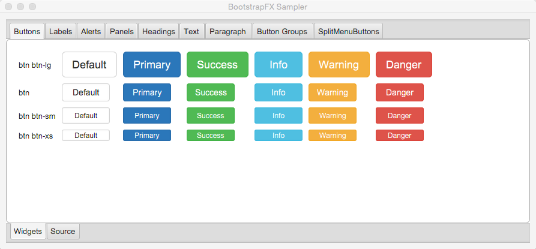
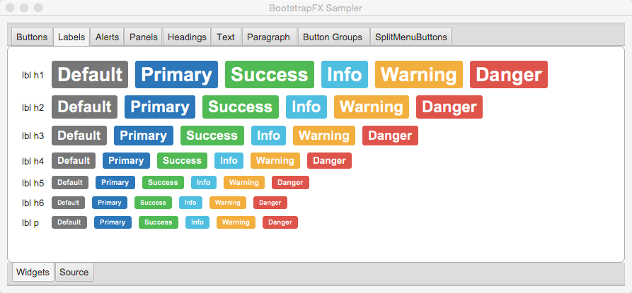
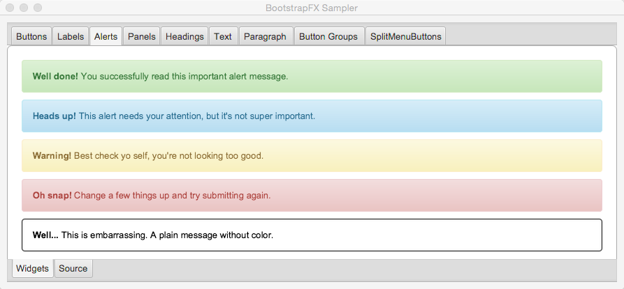
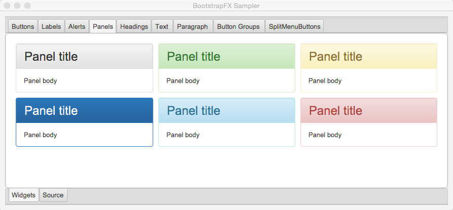
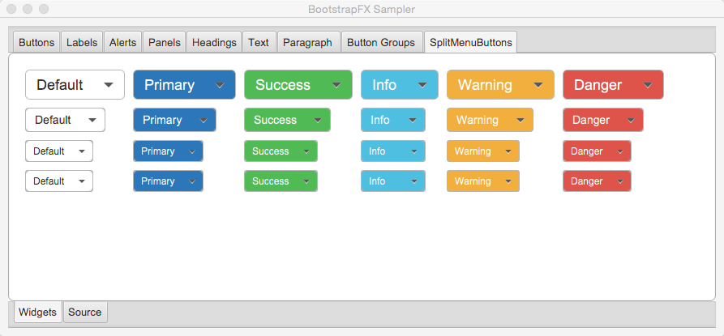

= BootstrapFX
:linkattrs:
:project-owner: aalmiray
:project-repo: kordamp
:project-name: bootstrapfx-core

image:http://img.shields.io/badge/license-MIT-blue.svg["MIT Licensed", link="http://opensource.org/licenses/MIT"]
image:https://api.bintray.com/packages/{project-owner}/{project-repo}/{project-name}/images/download.svg[link="https://bintray.com/{project-owner}/{project-repo}/{project-name}/_latestVersion"]

---

BootstrapFX is a partial port of link:http://getbootstrap.com/[Twitter Bootstrap] for JavaFX. It mainly provides a CSS
stylesheet that closely resembles the original while being custom tailored for JavaFX's unique CSS flavor.

It's worth mentioning that Twitter Bootstrap delivers more than just a standardized look for common widgets. It also
provides new widgets, behavior and a grid system. Some of these features may be ported at a later stage to BootstrapFX.

== Installing

You can get the latest version of **BootstrapFX** directly from link:https://bintray.com[Bintray's JCenter] repository.
Once the `bootstrapfx-core` dependency is in your classpath you just need to apply the `boostrapfx.css` stylesheet to
an scene, for example

[source,java]
----
import javafx.application.Application;
import javafx.geometry.Insets;
import javafx.scene.Node;
import javafx.scene.Scene;
import javafx.scene.control.Button;
import javafx.scene.layout.BorderPane;
import javafx.stage.Stage;
import org.kordamp.bootstrapfx.scene.layout.Panel;

public class Sampler extends Application {
    @Override
    public void start(Stage primaryStage) throws Exception {  //<1>
        Panel panel = new Panel("This is the title");
        panel.getStyleClass().add("panel-primary");           //<2>
        BorderPane content = new BorderPane();
        content.setPadding(new Insets(20));
        Button button = new Button("Hello BootstrapFX");
        button.getStyleClass().setAll("btn","btn-danger");    //<2>
        content.setCenter(button);
        panel.setBody(content);

        Scene scene = new Scene(panel);
        scene.getStylesheets().add("bootstrapfx.css");        //<3>

        primaryStage.setTitle("BootstrapFX");
        primaryStage.setScene(scene);
        primaryStage.sizeToScene();
        primaryStage.show();
    }
}
----
<1> Custom widget from BootstrapFX
<2> Apply CSS class to widgets
<3> Apply BootstrapFX stylesheet to scene

== Building

You must meet the following requirements:

 * JDK8u40 as a minimum
 * Gradle 2.6

You may used the included gradle wrapper script if you don't have `gradle` installed.

=== Installing Gradle

.Manual

 . Download Gradle from http://gradle.org/downloads
 . Unzip the file into a directory without spaces (recommended).
 . Create a GRADLE_HOME environment variable that points to this directory.
 . Adjust your PATH environment variable to include $GRADLE_HOME/bin (%GRADLE_HOME%\bin on Windows).
 . Test your setup by invoking `gradle --version`.

.SDKMAN

 . Follow the instructions found at http://sdkman.io/ to install SDKMAN.
 . You need a POSIX environment if running Windows. We recommend using Babun Shell (http://babun.github.io/)
 . Once SDKMAN is installed invoke `sdk install gradle 2.6`.
 . Test your setup by invoking `gradle --version`.

.Gdub

GDub is a wrapper script that facilitates invoking gradle tasks anywhere within a Gradle project. It's smart enough
to use the gradle wrapper if available or your global gradle command. This is an optional download.

 . Follow the instructions found at https://github.com/dougborg/gdub to install gdub

=== Next Steps

 . Make a full build issuing `gradle build`.
 . Run the sampler application by invoking the following commands
[source]
----
$ cd subprojects/sampler
$ gradle run
----

== Supported CSS Classes

=== Text

 * b, strong
 * i, em, italic, dfn
 * small
 * code, kbd, pre, samp
 * h1, h2, h3, h4, h5, h6
 * lead
 * p
 * text-mute
 * text-primary, text-success, text-info, text-warning, text-danger
 * bg-primary, bg-success, bg-info, bg-warning, bg-danger

=== Buttons

 * btn
 * btn-default, btn-primary, btn-success, btn-info, btn-warning, btn-danger
 * btn-lg, btn-sm, btn-xs

=== SplitMenu Buttons

 * split-menu-btn
 * split-menu-btn-default, split-menu-btn-primary, split-menu-btn-success, split-menu-btn-info, split-menu-btn-warning, split-menu-btn-danger
 * split-menu-btn-lg, split-menu-btn-sm, split-menu-btn-xs

=== Labels

 * lbl
 * lbl-default, lbl-primary, lbl-success, lbl-info, lbl-warning, lbl-danger

=== Panels

 * panel
 * panel-default, panel-primary, panel-success, panel-info, panel-warning, panel-danger
 * panel-heading
 * panel-title
 * panel-body
 * panel-footer

=== Alerts

 * alert
 * alert-success, alert-info, alert-warning, alert-danger

== Groups

 * btn-group-horizontal
 * btn-group-vertical

*NOTE:* all elements inside the vertical button group must have the same width.

=== Miscellaneous

 * badge

== Screenshots

== Changelog

.0.2.0

 * SplitMenu Button support
 * Button group support
 * `lead` on Text

.0.1.0

 * First release
